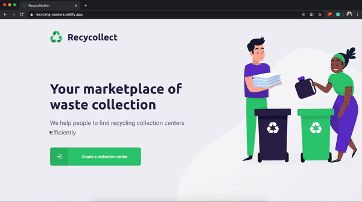

<h1 align="center">
    Recycollect ♻️
</h1>

<h5 align="center"> 
	Recycollecting is a project developed based on international environment week.
  That aims to connect people to companies that collect specific waste such as light bulbs, batteries, cooking oil to correctly dispose these items.
</h5>
<p align="center">
  <a href="https://github.com/barbosagabriel/recycling-collection-centers/commits/master">
    
  </a>
  &nbsp;&nbsp;
  
</p>

<p align="center">
  <a href="#-preview">Preview</a>&nbsp;&nbsp;&nbsp;|&nbsp;&nbsp;&nbsp;
  <a href="#rocket-Technologies">Technologies</a>&nbsp;&nbsp;&nbsp;|&nbsp;&nbsp;&nbsp;
  <a href="#-Usage">Usage</a>&nbsp;&nbsp;&nbsp;|&nbsp;&nbsp;&nbsp;
  <a href="#-Credits"> Credits</a>&nbsp;&nbsp;&nbsp;|&nbsp;&nbsp;&nbsp;&nbsp;
  <a href="#memo-license">License</a>
</p>

## 💻 Preview

### **API**

Check out the [docs](https://recycling-center-api.herokuapp.com/docs/) and [try it](https://recycling-center-api.herokuapp.com/recyclable-item)

<hr/>

### **Web**

Check on [Netlify](https://recycling-centers.netlify.app/)

<h1 align="center" style="border-radius:10px" >
    
</h1>

### **Mobile**

Download [Expo Client app](https://expo.io/tools#client) and scan the QR Code in this [page](https://expo.io/@barbosagabriel/recycling-centers) or try it out on [simulator](https://expo.io/appetize-simulator?url=https://expo.io/@barbosagabriel/recycling-centers)

<h1 align="center">
    
</h1>

## :rocket: Technologies

This project was developed with the following technologies:

- [Node.js][nodejs]
- [TypeScript][typescript]
- [React][reactjs]
- [React Native][rn]
- [Expo][expo]

## :information_source: Usage

To clone and run this application, you'll need [Git](https://git-scm.com), [Node.js][nodejs] and [Expo][expo] installed on your computer.

From your command line:

### Install API

```bash
# Clone this repository
$ git clone https://github.com/barbosagabriel/recycling-collection-centers

# Go into the repository
$ cd recycling-collection-centers/api

# Install dependencies
$ npm install

# Run Migrates
$ npm knex:migrate

# Run Seeds
$ npm knex:seed

# Start server *
$ npm run dev

# running on port 3333
```

\*Before start the server, rename .envexample to .env and edit the variable `API_HOST` with your local IP.
`API_HOST=http://{local_ip}:3333`

### Install Front-end

```bash
# Clone this repository
$ git clone https://github.com/barbosagabriel/recycling-collection-centers

# Go into the repository
$ cd recycling-collection-centers/web

# Install dependencies
$ npm install

# Run server *
$ npm run start

# running on port 3000
```

\*Before start the server, rename .envexample to .env and edit the variable `REACT_APP_API_HOST` with your local IP.
`REACT_APP_API_HOST=http://{local_ip}:3333`

### Install Mobile

```bash
# Clone this repository
$ git clone https://github.com/barbosagabriel/recycling-collection-centers

# Go into the repository
$ cd recycling-collection-centers/mobile

# Install dependencies
$ npm install

# Run *
$ npm run start

# Expo will open, just scan the qrcode on terminal or expo page or either use a iOS/Android emulator
```

\*Before start the server, open config/variables.ts, locate dev variables, and replace `apiUrl` with your local IP.

```bash
dev: {
    environment: "DEV",
    apiUrl: "http://{local_ip}:3333"
}
```

## :mortar_board: Credits

<p>This project was based on the content of Next Level Week (NLW), which is a practical week with lots of code, challenges, networking and a single objective: to take you to the next level.</p>

NLW is provided by [Rocketseat](https://rocketseat.com.br/) and was guided by [Diego Fernandes](https://github.com/diego3g).

## :memo: License

This project is under the MIT license. See the [LICENSE](https://github.com/barbosagabriel/recycling-collection-centers/blob/master/LICENSE) for details.

<hr/>
<p align="center">
Made with ♥ by Gabriel Barbosa
</p>

[nodejs]: https://nodejs.org/
[typescript]: https://www.typescriptlang.org/
[expo]: https://expo.io/
[reactjs]: https://reactjs.org
[rn]: https://facebook.github.io/react-native/
